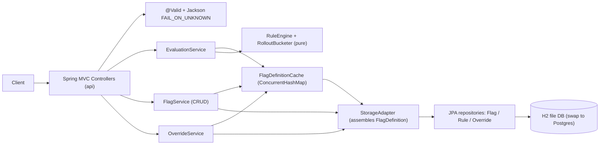
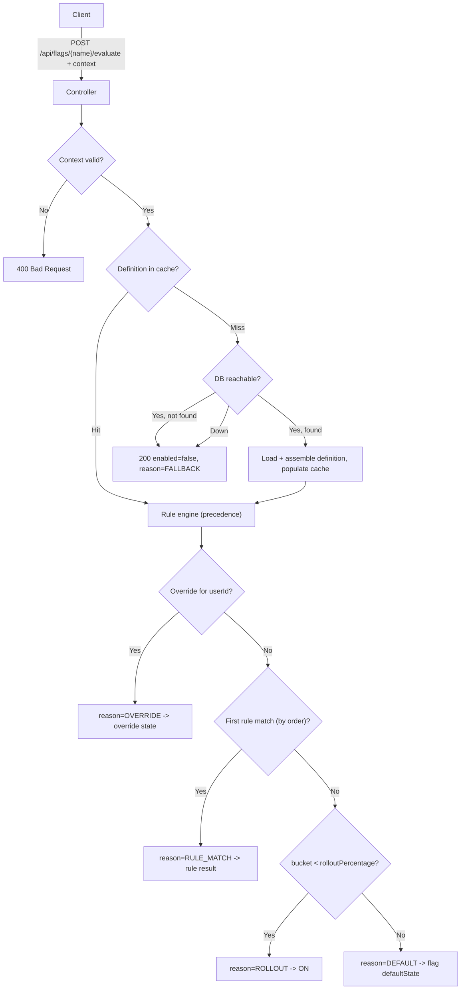
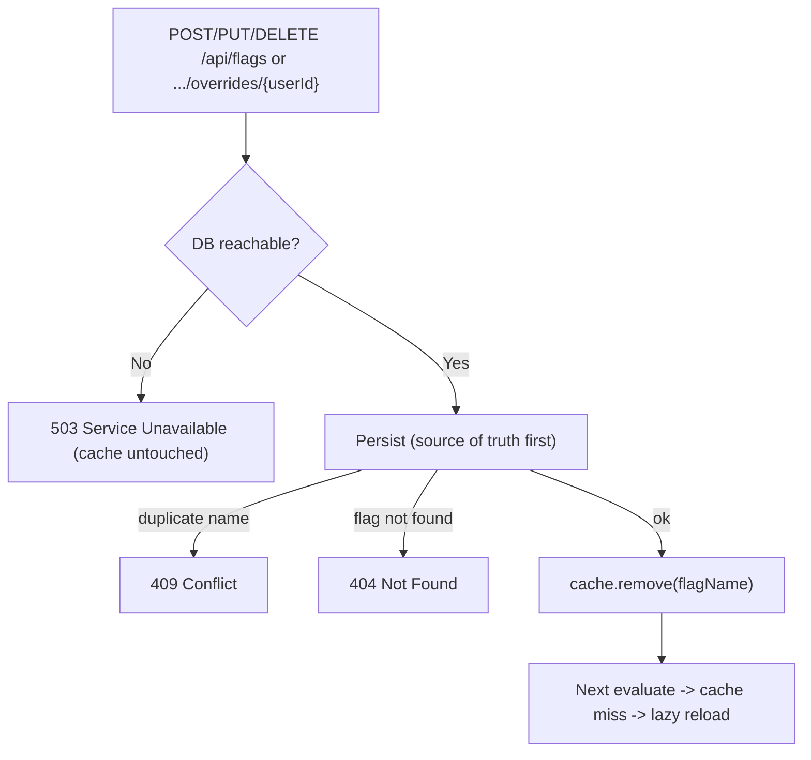
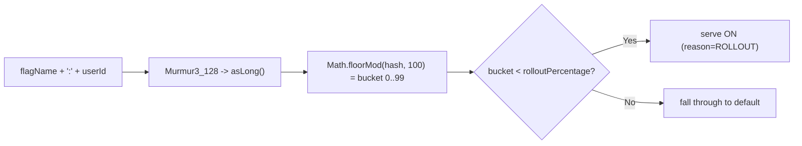

# Architecture

Request -> cache -> storage lifecycle for the feature-flag service. See [DESIGN.md](../DESIGN.md)
for the full design and [DECISIONS.md](../DECISIONS.md) for tradeoffs.

## Component view

## Evaluation request lifecycle (cache + precedence + fallback)

## Write path (cache invalidation)

## Rollout bucketing

